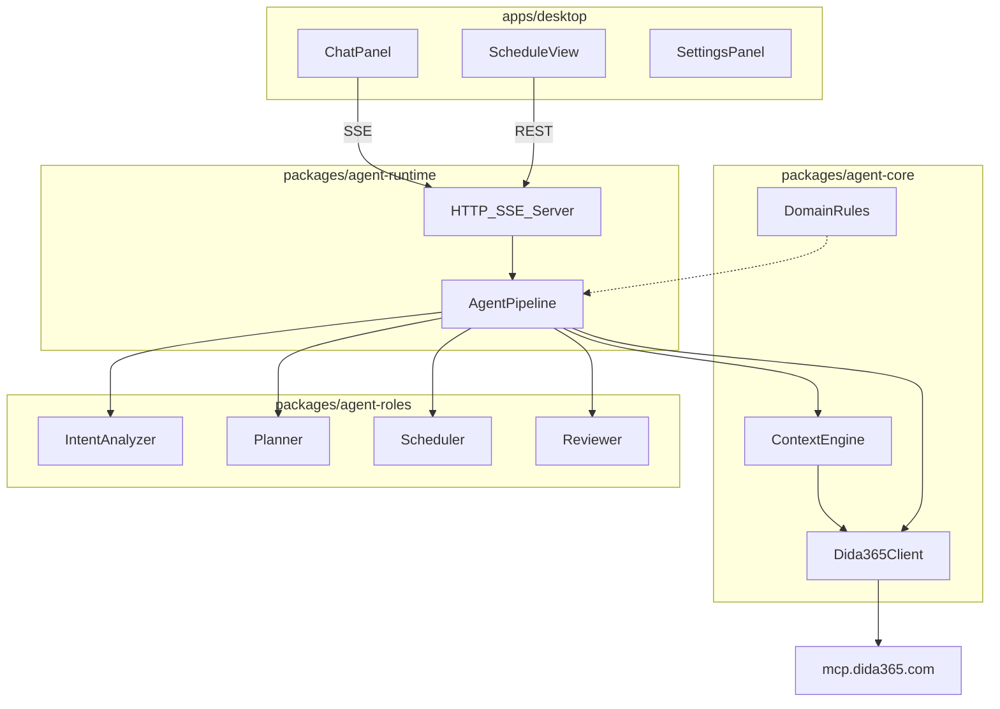

# Toka 滴答清单 Agent 设计规格

**日期：** 2026-06-20  
**状态：** 已批准  
**仓库：** `/Users/dean/code/toka`

---

## 1. 背景与目标

Toka 是一款全新设计的 Tauri 桌面应用，内置 Agent 运行时，通过 HTTP MCP 对接滴答清单（`https://mcp.dida365.com`），帮助用户管理任务、日程与清单。

### 1.1 与已有资产的关系

| 资产 | 路径/标识 | 用途 |
|------|-----------|------|
| 滴答 MCP | `user-dida365`（47 工具） | Agent 唯一外部数据源 |
| 领域 Skill | `/Users/dean/todo/.cursor/skills/dida365-task-management` | 领域规则来源（sortOrder、priority、parentId 等） |
| Rick | `/Users/dean/code/rick` | 参考实现，**不 fork**，Toka 独立代码 |

### 1.2 用户决策摘要

| 维度 | 选择 |
|------|------|
| 形态 | 独立桌面应用（Tauri） |
| 与 Rick | 全新重写，借鉴思路 |
| 核心能力 | 四角色：意图分析 / 规划 / 日程 / 回顾 |
| 改进目标 | 架构、体验、Agent 智能全面优化 |
| 写操作 | 自动执行，无需确认与回滚 |

### 1.3 非目标（MVP）

- 习惯打卡（`list_habits` 等）
- 专注记录（`create_focus` 等）
- 倒计时（`list_countdowns`）
- 标签管理（默认不使用，用户明确要求时才启用）
- Web / 移动端
- 写操作撤销 / 回滚

---

## 2. 架构方案

**选定方案：分层 Monorepo + Pipeline Agent（方案 C）**

```
toka/
├── apps/desktop/              # Tauri + React 前端
├── packages/agent-core/       # MCP 客户端、Context Engine、DomainRules
├── packages/agent-roles/      # 四角色 prompt 与工具策略
└── packages/agent-runtime/    # LLM client、tool loop、Pipeline、HTTP/SSE
```

### 2.1 系统架构图



### 2.2 Pipeline 五阶段

| 阶段 | 职责 | 输出 |
|------|------|------|
| **Understand** | 意图分析 | `AnalyzerResult`（intent、role、entities、contextNeeded） |
| **Context** | 按需预取滴答数据 | `UserSnapshot` |
| **Plan** | 选 role prompt + 工具子集 | system prompt + 可用 tools |
| **Execute** | LLM tool-calling 循环 | tool 结果 + 写操作记录 |
| **Summarize** | 中文摘要 + 变更清单 | 最终回复 + `actions_applied` 事件 |

### 2.3 与 Rick 的关键差异

| 点 | Rick | Toka |
|----|------|------|
| 模块 | 单 package 混排 | core / runtime / roles 三包 |
| 确认流 | `PendingConfirmation` + ConfirmDialog | 移除，写操作直接执行 |
| 上下文 | `context-builder` 一次性拉取 | `ContextEngine` 按需 + 60s TTL 缓存 |
| 领域规则 | 散落在 prompt | 独立 `DomainRules` |
| UI | Chat + DebugLog | Chat + Schedule 双栏，Debug 默认关 |
| SSE | 含 `confirmation_required` | 移除；新增 `actions_applied` |

---

## 3. Agent 四角色

### 3.1 意图路由

`IntentAnalyzer` 输出 JSON：

```json
{
  "intent": "create" | "update" | "schedule" | "breakdown" | "review" | "query",
  "role": "general" | "planner" | "scheduler" | "reviewer",
  "entities": {
    "projectNames": ["项目名"],
    "dateRange": { "start": "ISO8601", "end": "ISO8601" },
    "keywords": ["关键词"]
  },
  "contextNeeded": ["projects" | "tasks" | "dateRange"]
}
```

| intent | 默认 role | 典型用户说法 |
|--------|-----------|--------------|
| `breakdown` | planner | 「把这个目标拆成子任务」 |
| `schedule` | scheduler | 「帮我把这些安排到本周」 |
| `review` | reviewer | 「清理过期任务」「做个回顾」 |
| `create` | general | 「加个待办：买牛奶」 |
| `update` | general | 「把 X 改到明天」「标记完成」 |
| `query` | scheduler / general | 「今天有什么事」「本周待办」 |

LLM 解析失败时使用 heuristic fallback（正则规则，与 Rick 同类）。

### 3.2 角色职责

**General** — 单条 CRUD、简单查询。

**Planner**
- 目标拆解 → `batch_add_tasks`（`parentId` + 递增 `sortOrder`）
- 可 `create_project` 建新清单
- 写前 `list_projects` 防重复
- 禁止 `delete_task`

**Scheduler**
- 读：`list_undone_tasks_by_date`（≤14 天/次）、`filter_tasks`
- 写：`update_task` 设日期
- 识别时间冲突并提醒（不阻塞）
- 回答日期类查询前**必须**调工具，不可凭预取断言「无任务」

**Reviewer**
- 扫描过期、无日期、高优先级堆积
- 可 `delete_task`、`batch_update_tasks`
- 删除自动执行；prompt 要求删除前在回复中说明理由与影响范围

### 3.3 Prompt 模块（`packages/agent-roles/prompts/`）

```
shared.ts      # 身份、日期、查询、写入、项目规则
analyzer.ts
general.ts
planner.ts
scheduler.ts
reviewer.ts
```

共享规则要点（来自 `dida365-task-management` skill）：
- `sortOrder` / `priority`（0/1/3/5）/ `parentId` 维护
- 子任务 `projectId` 必须与父任务相同
- 清除日期：`"1970-01-01T00:00:00.000+0000"`
- 默认时区 `Asia/Shanghai`
- 默认不使用标签

**Toka 特有：** `SHARED_WRITE_RULES` 不含确认/回滚相关措辞。

### 3.4 按 role 过滤的工具子集

| role | 工具 |
|------|------|
| general | `list_projects`, `search_task`, `get_task_by_id`, `create_task`, `update_task`, `complete_task`, `move_task`, `get_project_with_undone_tasks`, `get_user_preference` |
| planner | general + `create_project`, `batch_add_tasks` |
| scheduler | general + `list_undone_tasks_by_date`, `list_undone_tasks_by_time_query`, `filter_tasks`, `batch_update_tasks` |
| reviewer | scheduler + `delete_task`, `list_completed_tasks_by_date`, `batch_update_tasks` |

MVP 约 18 个工具；完整 MCP 47 工具中其余不在 MVP 范围。

### 3.5 Summarize 输出模板

```markdown
## 已完成
- ➕ 创建「…」（清单 / 日期 / 优先级）
- ✏️ 更新「…」→ …
- ✅ 完成「…」
- 🗑️ 删除「…」（原因：…）

## 建议（可选）
- …
```

---

## 4. Context Engine

### 4.1 数据结构

```typescript
interface UserSnapshot {
  fetchedAt: number;           // 缓存 TTL 60s
  timezone: "Asia/Shanghai";
  today: string;               // YYYY-MM-DD，prompt 权威「今日」来源
  projects: ProjectSummary[];
  matchedTasks: TaskSummary[];
  dateRangeTasks: TaskSummary[];
  dateRangeLabel?: string;
}
```

### 4.2 拉取策略

| 键 | 条件 | 工具 |
|----|------|------|
| `projects` | 几乎总是（除非纯关键词且已有 projectId） | `list_projects` |
| `tasks` | 有 `keywords` | `search_task` |
| `dateRange` | intent 为 schedule/review/query，或消息含日期词 | `list_undone_tasks_by_date`（长范围分段，每段 ≤14 天） |

不预拉 `tags`（除非未来用户设置开启）。

预取为空时注入 prompt 警告：「预取无结果，回答前须调工具核实」。

---

## 5. UI / 交互 / 数据流

### 5.1 布局

```
┌─────────────────────────────────────────────────────┐
│  Toka · 滴答清单 Agent          [对话] [设置]        │
├──────────────────────────┬──────────────────────────┤
│  ChatPanel (左 ~55%)     │  ScheduleView (右 ~45%)   │
│  - 消息流 + 流式输出      │  - 今日 / 本周 Tab        │
│  - 折叠式 tool trace     │  - MCP 直读刷新            │
│  - 输入框 + 快捷指令      │  - 点击任务 → 填入对话      │
└──────────────────────────┴──────────────────────────┘
```

- 无 ConfirmDialog
- Debug 面板：设置中开关，默认关闭

### 5.2 SSE 事件

| 事件 | 说明 |
|------|------|
| `text_delta` | 流式文本 |
| `tool_start` / `tool_end` | 工具调用（默认折叠） |
| `mcp_call` | 仅 debug 模式记录 |
| `actions_applied` | **新增** — 结构化变更 `{ type, taskTitle, detail }[]` |
| `done` | 结束 streaming |
| `error` | 错误消息 |

### 5.3 REST API（sidecar）

| 方法 | 路径 | 说明 |
|------|------|------|
| POST | `/api/chat` | SSE 流式对话 |
| GET | `/api/tasks?range=today\|week` | ScheduleView 直读 MCP |
| GET/POST | `/api/config` | 读写 LLM + Token 配置 |
| DELETE | `/api/sessions/:id` | 清空对话历史 |

写操作完成后前端收到 `done` 时自动 refresh ScheduleView。

ScheduleView 点击任务 → 输入框预填「关于任务『{title}』…」。

### 5.4 凭证存储

| 字段 | 存储 |
|------|------|
| LLM Base URL / API Key / Model | OS Keychain（Tauri plugin） |
| 滴答 Token | Keychain |
| MCP URL | 默认 `https://mcp.dida365.com`，可配置 |
| Debug 模式 | localStorage |

Rust 层职责：启动 sidecar、Keychain 读写；Agent 逻辑全在 TS packages。

---

## 6. 错误处理

| 场景 | 行为 |
|------|------|
| MCP 鉴权失败 | 提示重新配置 Token |
| LLM 超时 | 重试 1 次，失败返回错误 + 已完成 tool 结果 |
| 单次 tool 失败 | error 喂回 LLM 尝试修正 |
| 连续 3 次 tool 失败 | 中止 loop，返回部分结果与错误说明 |

---

## 7. 测试策略

| 层 | 范围 |
|----|------|
| `agent-core` | 日期范围解析、context 缓存 TTL、DomainRules 单元测试 |
| `agent-runtime` | mock MCP 的 Pipeline 集成测试 |
| `agent-roles` | prompt 组装快照测试（可选） |
| UI | MVP 不做 E2E |

---

## 8. 技术选型

| 层级 | 选型 |
|------|------|
| 桌面壳 | Tauri 2 + React + Vite + TypeScript |
| 包管理 | pnpm workspace |
| Agent | TypeScript sidecar |
| LLM | OpenAI 兼容 API（`openai` npm） |
| 滴答 | HTTP MCP（Bearer Token） |
| 样式 | Tailwind CSS（与 Rick 一致） |

---

## 9. 项目结构（目标）

```
toka/
├── apps/desktop/
│   ├── src/
│   │   ├── components/
│   │   │   ├── Chat/
│   │   │   ├── Schedule/
│   │   │   └── Settings/
│   │   ├── hooks/
│   │   └── App.tsx
│   └── src-tauri/
├── packages/agent-core/
│   ├── src/
│   │   ├── mcp/
│   │   ├── context/
│   │   └── rules/
│   └── package.json
├── packages/agent-roles/
│   ├── src/prompts/
│   └── package.json
├── packages/agent-runtime/
│   ├── src/
│   │   ├── pipeline/
│   │   ├── llm/
│   │   └── server.ts
│   └── package.json
├── docs/superpowers/
│   ├── specs/
│   └── plans/
├── pnpm-workspace.yaml
└── package.json
```

---

## 10. 开放问题（实现阶段决定）

1. Sidecar 默认端口（建议 17200，避免与 Rick 冲突）
2. 对话持久化：内存 vs SQLite（MVP 可用内存 + 可选文件）
3. LLM 默认模型名（设置页留空，用户自填）

---

## 11. 验收标准（MVP）

- [ ] Tauri 应用启动，sidecar 自动连接
- [ ] 设置页配置 LLM + 滴答 Token 后可对话
- [ ] 「今天有什么事」→ 调 MCP 返回真实任务列表
- [ ] 「加个待办」→ 自动创建，ScheduleView 刷新可见
- [ ] 「把 X 拆成子任务」→ Planner 批量创建带 parentId
- [ ] 「清理过期任务」→ Reviewer 扫描并给出建议/执行
- [ ] 写操作无确认弹窗，回复含「已完成」摘要
- [ ] Debug 模式可查看 MCP 请求日志
